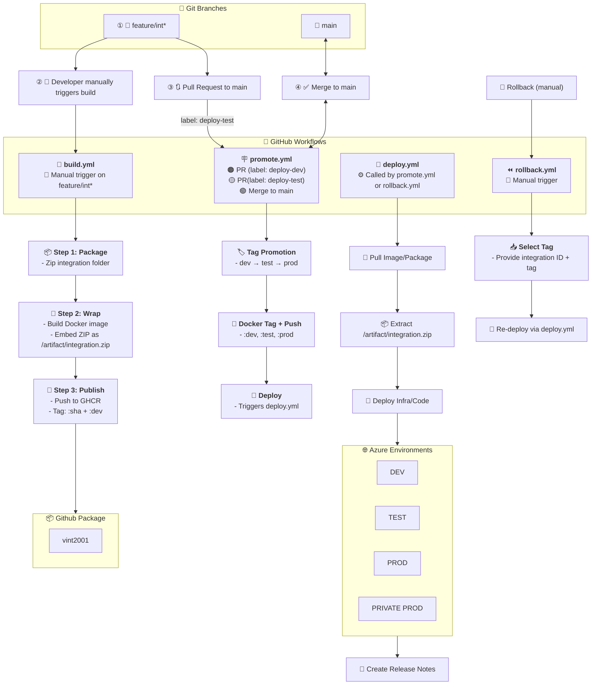

```mermaid
---
config:
  layout: dagre
---
flowchart TD
 subgraph GIT["📁 Git Branches"]
        branchFeature["① 🌱 feature/int*"]
        branchMain["🌳 main"]
  end
 subgraph ENVIRONMENTS["🌐 Azure Environments"]
        ENV_DEV["DEV"]
        ENV_TEST["TEST"]
        ENV_PROD["PROD"]
        ENV_HYBRID_PROD["PRIVATE PROD"]
  end
 subgraph Package["📦 Github Package"]
        p1["vint2001"]
  end
 subgraph WORKFLOWS["🚀 GitHub Workflows"]
        W1["🔧 <b>build.yml</b><br>🔵 Manual trigger on feature/int*"]
        W2["🪧 <b>promote.yml</b><br>🟠 PR (label: deploy-dev)<br>🟡 PR(label: deploy-test)<br>🟢 Merge to main"]
        W3["🚢 <b>deploy.yml</b><br>⚙️ Called by promote.yml or rollback.yml"]
        W4["⏪ <b>rollback.yml</b><br>🔵 Manual trigger"]
  end
    W1 --> B1["📦 <b>Step 1: Package</b><br>- Zip integration folder"]
    B1 --> B2["🐳 <b>Step 2: Wrap</b><br>- Build Docker image<br>- Embed ZIP as /artifact/integration.zip"]
    B2 --> B3["🐳 <b>Step 3: Publish</b><br>- Push to GHCR<br>- Tag: :sha + :dev"]
    B3 --> Package
    
    
    W2 --> P1["🏷️ <b>Tag Promotion</b><br>- dev → test → prod"]
    P1 --> P2["🐳 <b>Docker Tag + Push</b><br>- :dev, :test, :prod"]
    P2 --> P3["🔄 <b>Deploy</b><br>- Triggers deploy.yml"]
    
    W3 --> D1["🐳 Pull Image/Package"]
    D1 --> D2["📦 Extract /artifact/integration.zip"]
    D2 --> D3["🚀 Deploy Infra/Code"]
    D3 --> ENVIRONMENTS
    ENVIRONMENTS --> D4["📝 Create Release Notes"]
    
    W4 --> R1["📥 <b>Select Tag</b><br>- Provide integration ID + tag"]
    R1 --> R2["🔄 Re-deploy via deploy.yml"]
    branchFeature --> DevPush["② 🧍 Developer manually triggers build"]
    branchFeature --> PR["③ 🔃 Pull Request to main"]
    DevPush --> W1
    PR -- "label: deploy-test" --> W2
    
    
    branchMain <--> MergeMain["④ ✅ Merge to main"]
    MergeMain <--> W2
    ManualRollback["🧍 Rollback (manual)"] --> W4


```

hello
