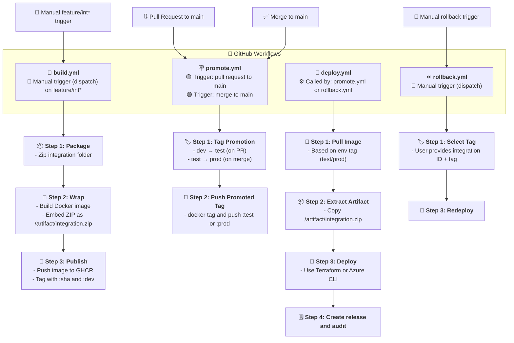

```mermaid
flowchart TD
 subgraph subGraph0["🚀 GitHub Workflows"]
        W1["🔧 <b>build.yml</b><br>🔵 Manual trigger (dispatch) on feature/int*"]
        W2["🪧 <b>promote.yml</b><br>🟡 Trigger: pull request to main<br>🟢 Trigger: merge to main"]
        W3["🚢 <b>deploy.yml</b><br>⚙️ Called by: promote.yml or rollback.yml"]
        W4["⏪ <b>rollback.yml</b><br>🔵 Manual trigger (dispatch)"]
  end
    W1 --> B1["📦 <b>Step 1: Package</b><br>- Zip integration folder"]
    B1 --> B2["🐳 <b>Step 2: Wrap</b><br>- Build Docker image<br>- Embed ZIP as /artifact/integration.zip"]
    B2 --> B3["🐳 <b>Step 3: Publish</b><br>- Push image to GHCR<br>- Tag with :sha and :dev"]
    W2 --> P1["🏷️ <b>Step 1: Tag Promotion</b><br>- dev → test (on PR)<br>- test → prod (on merge)"]
    P1 --> P2["🐳 <b>Step 2: Push Promoted Tag</b><br>- docker tag and push :test or :prod"]
    W3 --> D1["🐳 <b>Step 1: Pull Image</b><br>- Based on env tag (test/prod)"]
    D1 --> D2["📦 <b>Step 2: Extract Artifact</b><br>- Copy /artifact/integration.zip"]
    D2 --> D3["🚀 <b>Step 3: Deploy</b><br>- Use Terraform or Azure CLI"]
    D3 --> D4["🗒️ <b>Step 4: Create release and audit</b><br>"]
    W4 --> R1["🏷️ <b>Step 1: Select Tag</b><br>- User provides integration ID + tag"]
    R1 --> R2["🔄 <b>Step 3: Redeploy</b><br>"]
    DevPush["🧍 Manual feature/int* trigger"] --> W1
    PullRequest["🔃 Pull Request to main"] --> W2
    MergeMain["✅ Merge to main"] --> W2
    ManualRollback["🧍 Manual rollback trigger"] --> W4
```
