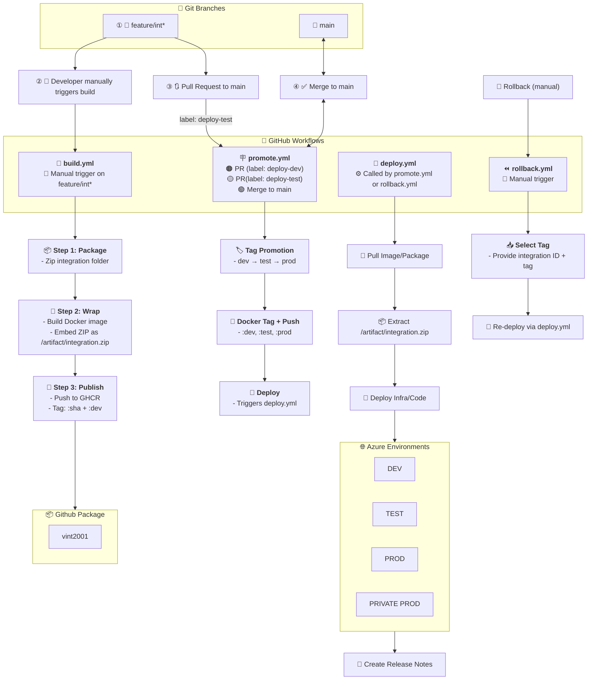
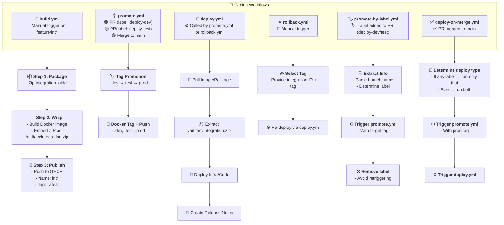
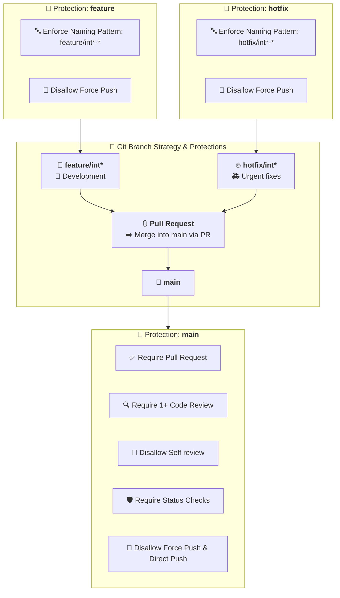

```mermaid
---
config:
  layout: dagre
---
flowchart TD
 subgraph GIT["📁 Git Branches"]
        branchFeature["① 🌱 feature/int*"]
        branchMain["🌳 main"]
  end
 subgraph ENVIRONMENTS["🌐 Azure Environments"]
        ENV_DEV["DEV"]
        ENV_TEST["TEST"]
        ENV_PROD["PROD"]
        ENV_HYBRID_PROD["PRIVATE PROD"]
  end
 subgraph Package["📦 Github Package"]
        p1["vint2001"]
  end
 subgraph WORKFLOWS["🚀 GitHub Workflows"]
        W1["🔧 <b>build.yml</b><br>🔵 Manual trigger on feature/int*"]
        W2["🪧 <b>promote.yml</b><br>🟠 PR (label: deploy-dev)<br>🟡 PR(label: deploy-test)<br>🟢 Merge to main"]
        W3["🚢 <b>deploy.yml</b><br>⚙️ Called by promote.yml or rollback.yml"]
        W4["⏪ <b>rollback.yml</b><br>🔵 Manual trigger"]
  end
    W1 --> B1["📦 <b>Step 1: Package</b><br>- Zip integration folder"]
    B1 --> B2["🐳 <b>Step 2: Wrap</b><br>- Build Docker image<br>- Embed ZIP as /artifact/integration.zip"]
    B2 --> B3["🐳 <b>Step 3: Publish</b><br>- Push to GHCR<br>- Tag: :sha + :dev"]
    B3 --> Package
    W2 --> P1["🏷️ <b>Tag Promotion</b><br>- dev → test → prod"]
    P1 --> P2["🐳 <b>Docker Tag + Push</b><br>- :dev, :test, :prod"]
    P2 --> P3["🔄 <b>Deploy</b><br>- Triggers deploy.yml"]
    W3 --> D1["🐳 Pull Image/Package"]
    D1 --> D2["📦 Extract /artifact/integration.zip"]
    D2 --> D3["🚀 Deploy Infra/Code"]
    D3 --> ENVIRONMENTS
    ENVIRONMENTS --> D4["📝 Create Release Notes"]
    W4 --> R1["📥 <b>Select Tag</b><br>- Provide integration ID + tag"]
    R1 --> R2["🔄 Re-deploy via deploy.yml"]
    branchFeature --> DevPush["② 🧍 Developer manually triggers build"] & PR["③ 🔃 Pull Request to main"]
    DevPush --> W1
    PR -- "label: deploy-test" --> W2
    branchMain <--> MergeMain["④ ✅ Merge to main"]
    MergeMain <--> W2
    ManualRollback["🧍 Rollback (manual)"] --> W4
```

```mermaid
flowchart TD
  subgraph WORKFLOWS["🚀 GitHub Workflows"]
      W1["🔧 <b>build.yml</b><br>🔵 Manual trigger on feature/int*"]
      W2["🪧 <b>promote.yml</b><br>🟠 PR (label: deploy-dev)<br>🟡 PR(label: deploy-test)<br>🟢 Merge to main"]
      W3["🚢 <b>deploy.yml</b><br>⚙️ Called by promote.yml or rollback.yml"]
      W4["⏪ <b>rollback.yml</b><br>🔵 Manual trigger"]
      W5["🏷️ <b>promote-by-label.yml</b><br>🏷️ Label added to PR (deploy-dev/test)"]
      W6["✅ <b>deploy-on-merge.yml</b><br>✅ PR merged to main"]
  end

  %% build.yml
  W1 --> B1["📦 <b>Step 1: Package</b><br>- Zip integration folder"]
  B1 --> B2["🐳 <b>Step 2: Wrap</b><br>- Build Docker image<br>- Embed ZIP as /artifact/integration.zip"]
  B2 --> B3["🐳 <b>Step 3: Publish</b><br>- Push to GHCR<br>- Name: int* <br>- Tag: :latest"]

  %% promote.yml
  W2 --> P1["🏷️ <b>Tag Promotion</b><br>- dev → test → prod"]
  P1 --> P2["🐳 <b>Docker Tag + Push</b><br>- :dev, :test, :prod"]

  %% deploy.yml
  W3 --> D1["🐳 Pull Image/Package"]
  D1 --> D2["📦 Extract /artifact/integration.zip"]
  D2 --> D3["🚀 Deploy Infra/Code"]
  D3 --> D4["📝 Create Release Notes"]

  %% rollback.yml
  W4 --> R1["📥 <b>Select Tag</b><br>- Provide integration ID + tag"]
  R1 --> R2["⚙️ Re-deploy via deploy.yml"]

  %% promote-by-label.yml
  W5 --> L1["🔍 <b>Extract Info</b><br>- Parse branch name<br>- Determine label"]
  L1 --> L2["⚙️  <b>Trigger promote.yml</b><br>- With target tag"]
  L2 --> L3["❌ <b>Remove label</b><br>- Avoid retriggering"]

  %% deploy-on-merge.yml
  W6 --> M1["🧠 <b>Determine deploy type</b><br>- If any label → run only that<br>- Else → run both"]
  M1 --> M2["⚙️ <b>Trigger promote.yml</b><br>- With prod tag"]
  M2 --> M3["⚙️ <b>Trigger deploy.yml</b>"]
```

```mermaid
flowchart TD
  subgraph BRANCHES["🌳 Git Branch Strategy & Protections"]
    F1["🌱 <b>feature/int*</b><br>👷 Development"]
    HF["🔥 <b>hotfix/int*</b><br>🚑 Urgent fixes"]
    PR["🔃 <b>Pull Request</b><br>➡️ Merge into main via PR"]
    MAIN["🌳 <b>main</b><br>"]
  end
  F1 --> PR
  HF --> PR
  PR --> MAIN
  subgraph RULES_MAIN["🔐 Protection: <b>main</b>"]
    M1["✅ Require Pull Request"]
    M2["🔍 Require 1+ Code Review"]
    M3["🚫 Disallow Self review"]
    M4["🛡️ Require Status Checks"]
    M5["🚫 Disallow Force Push & Direct Push"]

  end
  subgraph RULES_FEATURE["🔐 Protection: <b>feature</b>"]
    F2["🔤 Enforce Naming Pattern: feature/int*-*"]
    F3["🚫 Disallow Force Push"]
  end
  subgraph RULES_HOTFIX["🔐 Protection: <b>hotfix</b>"]
    H2["🔤 Enforce Naming Pattern: hotfix/int*-*"]
    H3["🚫 Disallow Force Push"]
  end
  MAIN --> RULES_MAIN
  RULES_HOTFIX --> HF
  RULES_FEATURE --> F1
```

hello
