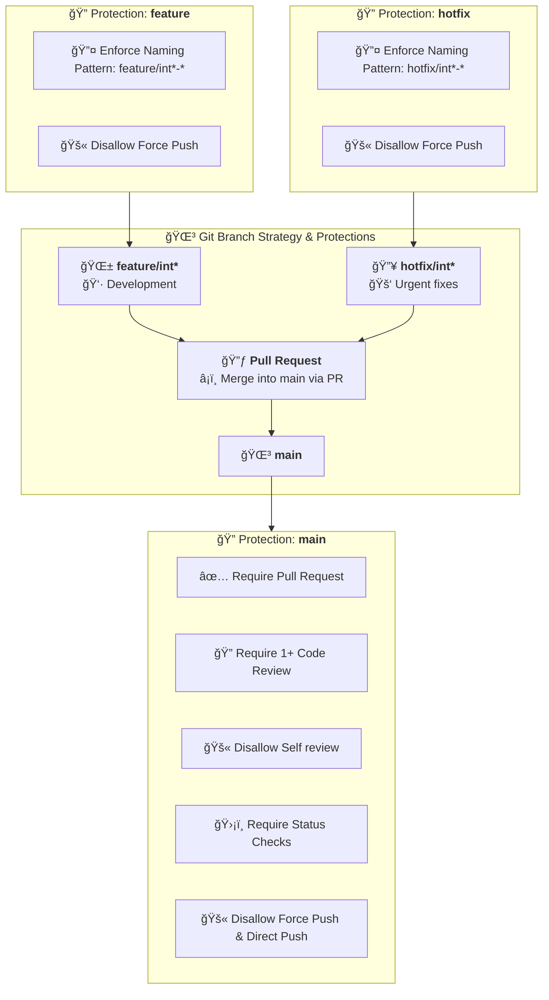

```mermaid
flowchart TD


  %% Developer steps
  subgraph PROCESS["Workflow process"]
      %% Developer & Git Process (Top vertical)
    DEV["🧑‍💻 Developer<br>- Create branch feature/int* <br>Push code"]
    PR["🔃 Open Pull Request <br>to main"]
    REVIEW["👀 Code Review & Approvals"]
    MERGE["✅ Merge PR to main"]
  end
  %% Build Phase
  subgraph BUILD["Build & Package"]
    B1["📦 Create integration package"]
  end

  %% Promotion Phase
  subgraph PROMOTE["Deploy Dev/Test"]
    P1["🏷️ Detect PR label"]
  end

  %% Deploy Phase
  subgraph DEPLOY["Deploy Package to PROD"]
    D3["🚀 Deploy infrastructure & application code"]

  end

  
  DEV --> BUILD
  PR --> PROMOTE
  REVIEW --> PROMOTE
  REVIEW --> DEPLOY
  MERGE --> DEPLOY
```

```mermaid
---
config:
  layout: dagre
---
flowchart TD

  %% Developer steps
  subgraph WORKPROCESS["Workflow process"]
      %% Developer & Git Process (Top vertical)
    WP1["🧑‍💻 Developer<br>- Create branch feature/int* <br>Push code"]
    WP2["🔃 Open Pull Request <br>to main"]
    WP3["👀 Code Review & Approvals"]
    WP4["✅ Merge PR to main"]
  end

  %% Build Phase
  subgraph WPBUILD["Build & Package"]
    B11["📦 Create integration package"]
  end

  %% Promotion Phase
  subgraph WPPROMOTE["Deploy Dev/Test"]
    P11["🏷️ Detect PR label"]
  end

  %% Deploy Phase
  subgraph WPDEPLOY["Deploy Package to PROD"]
    D32["🚀 Deploy infrastructure & application code"]

  end
  WP1 --> WPBUILD
  WP2 --> WPPROMOTE
  WP3 --> WPPROMOTE
  WP4 --> WPDEPLOY
  
  WPBUILD --> W1
  WPPROMOTE --> W5
  WPDEPLOY --> W6

  subgraph WORKFLOWS["🚀 GitHub Workflows"]
      W1["🔧 <b>build.yml</b><br>🔵 Manual trigger on feature/int*"]
      W2["🪧 <b>promote.yml</b><br>🟠 PR (label: deploy-dev)<br>🟡 PR(label: deploy-test)<br>🟢 Merge to main"]
      W3["🚢 <b>deploy.yml</b><br>⚙️ Called by promote.yml or rollback.yml"]
      W4["⏪ <b>rollback.yml</b><br>🔵 Manual trigger"]
      W5["🏷️ <b>promote-by-label.yml</b><br>🏷️ Label added to PR (deploy-dev/test)"]
      W6["✅ <b>deploy-on-merge.yml</b><br>✅ PR merged to main"]
  end

  %% build.yml
  W1 --> B1["📦 <b>Step 1: Package</b><br>- Zip integration folder"]
  B1 --> B2["🐳 <b>Step 2: Wrap</b><br>- Build Docker image<br>- Embed ZIP as /artifact/integration.zip"]
  B2 --> B3["🐳 <b>Step 3: Publish</b><br>- Push to GHCR<br>- Name: int* <br>- Tag: :latest"]

  %% promote.yml
  W2 --> P1["🏷️ <b>Tag Promotion</b><br>- dev → test → prod"]
  P1 --> P2["🐳 <b>Docker Tag + Push</b><br>- :dev, :test, :prod"]

  %% deploy.yml
  W3 --> D1["🐳 Pull Image/Package"]
  D1 --> D2["📦 Extract /artifact/integration.zip"]
  D2 --> D3["🚀 Deploy Infra/Code"]
  D3 --> D4["📝 Create Release Notes"]

  %% rollback.yml
  W4 --> R1["📥 <b>Select Tag</b><br>- Provide integration ID + tag"]
  R1 --> R2["⚙️ Re-deploy via deploy.yml"]

  %% promote-by-label.yml
  W5 --> L1["🔍 <b>Extract Info</b><br>- Parse branch name<br>- Determine label"]
  L1 --> L2["⚙️  <b>Trigger promote.yml</b><br>- With target tag"]
  L2 --> L3["⚙️  <b>Trigger deploy.yml</b><br>- With target tag"]
  L3 --> L4["❌ <b>Remove label</b><br>- Avoid retriggering"]

  %% deploy-on-merge.yml
  W6 --> M1["🧠 <b>Determine deploy type</b><br>- If any label → run only that<br>- Else → run both"]
  M1 --> M2["⚙️ <b>Trigger promote.yml</b><br>- With prod tag"]
  M2 --> M3["⚙️ <b>Trigger deploy.yml</b>"]
```

```mermaid
flowchart TD
  subgraph WORKFLOWS["🚀 GitHub Workflows"]
      W1["🔧 <b>build.yml</b><br>🔵 Manual trigger on feature/int*"]
      W2["🪧 <b>promote.yml</b><br>🟠 PR (label: deploy-dev)<br>🟡 PR(label: deploy-test)<br>🟢 Merge to main"]
      W3["🚢 <b>deploy.yml</b><br>⚙️ Called by promote.yml or rollback.yml"]
      W4["⏪ <b>rollback.yml</b><br>🔵 Manual trigger"]
      W5["🏷️ <b>promote-by-label.yml</b><br>🏷️ Label added to PR (deploy-dev/test)"]
      W6["✅ <b>deploy-on-merge.yml</b><br>✅ PR merged to main"]
  end

  %% build.yml
  W1 --> B1["📦 <b>Step 1: Package</b><br>- Zip integration folder"]
  B1 --> B2["🐳 <b>Step 2: Wrap</b><br>- Build Docker image<br>- Embed ZIP as /artifact/integration.zip"]
  B2 --> B3["🐳 <b>Step 3: Publish</b><br>- Push to GHCR<br>- Name: int* <br>- Tag: :latest"]

  %% promote.yml
  W2 --> P1["🏷️ <b>Tag Promotion</b><br>- dev → test → prod"]
  P1 --> P2["🐳 <b>Docker Tag + Push</b><br>- :dev, :test, :prod"]

  %% deploy.yml
  W3 --> D1["🐳 Pull Image/Package"]
  D1 --> D2["📦 Extract /artifact/integration.zip"]
  D2 --> D3["🚀 Deploy Infra/Code"]
  D3 --> D4["📝 Create Release Notes"]

  %% rollback.yml
  W4 --> R1["📥 <b>Select Tag</b><br>- Provide integration ID + tag"]
  R1 --> R2["⚙️ Re-deploy via deploy.yml"]

  %% promote-by-label.yml
  W5 --> L1["🔍 <b>Extract Info</b><br>- Parse branch name<br>- Determine label"]
  L1 --> L2["⚙️  <b>Trigger promote.yml</b><br>- With target tag"]
  L2 --> L3["⚙️  <b>Trigger deploy.yml</b><br>- With target tag"]
  L3 --> L4["❌ <b>Remove label</b><br>- Avoid retriggering"]

  %% deploy-on-merge.yml
  W6 --> M1["🧠 <b>Determine deploy type</b><br>- If any label → run only that<br>- Else → run both"]
  M1 --> M2["⚙️ <b>Trigger promote.yml</b><br>- With prod tag"]
  M2 --> M3["⚙️ <b>Trigger deploy.yml</b>"]
```

## ⚠️ Setup Instructions

After cloning the repo, run:

```bash
./setup-hooks.sh
```

This installs the Git hook to enforce good commit messages.

#### 🔃 Or hook into `post-checkout` / `post-merge` (optional)

Advanced: you could even auto-run `setup-hooks.sh` using another Git hook (like `post-checkout` or `post-merge`), but that would require some setup and doesn't always run on first clone.

---

### ✅ Summary

| Task                  | Done By       | Notes                            |
|-----------------------|---------------|----------------------------------|
| Write `commit-msg.sh` | You           | Add to `scripts/commit-msg.sh`  |
| Write `setup-hooks.sh`| You           | Installs symlink to `.git/hooks`|
| Run setup             | Each developer| Only once after cloning          |

Let me know if you want to expand it to check for hook installation automatically or prompt users when missing.


